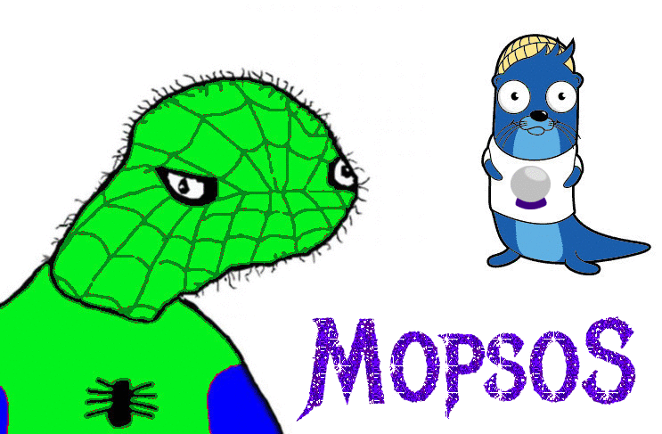

# Mopsos



Receives [CloudEvents](https://cloudevents.io/) from [Argo CD](https://argoproj.github.io/cd/) [notifications](https://argo-cd.readthedocs.io/en/stable/operator-manual/notifications/) and stores them for later analysis.

Mopsos knows the version of the applications installed in your cluster and helps you see
what you need to update.

## Architecture

### Information Flow

```mermaid
sequenceDiagram
    participant Argo CD
    participant Mopsos
    participant Database

    Argo CD->>+Mopsos: Argo CD Notifications sends app <br/>metadata in Cloudevent data
    Mopsos-->>-Argo CD: 200 OK
    Mopsos-)Database: upsert info into records table
    Note right of Database: The database can <br/>be queried directly <br/>or connected to <br/>dashboarding tools <br/>like metabase <br/>or grafana.
```

## Usage

```console
Mopsos receives events and stores them in a database for later analysis.

Usage:
  mopsos [flags]

Flags:
      --db-dsn string           Database DSN (default "file::memory:?cache=shared")
      --db-migrate              Migrate database schema on startup (default true)
      --db-provider string      Database provider, either 'sqlite' or 'postgres' (default "sqlite")
      --debug                   Enable debug mode
  -h, --help                    help for mopsos
      --http-listener string    HTTP listener (default ":8080")
      --otel                    Enable OpenTelemetry tracing
      --otel-collector string   Endpoint for OpenTelemetry Collector. On a local cluster the collector should be accessible through a NodePort service at the localhost:30078 endpoint. Otherwise replace localhost with the collector endpoint. (default "localhost:30079")
      --verbose                 Enable verbose mode
```

## Deployment

The recommended way to deploy Mopsos is using Helm:

```bash
helm repo add adfinis https://charts.adfinis.com
helm install adfinis/mopsos
```

Please refer to the [`mopsos` Helm chart](https://github.com/adfinis-sygroup/helm-charts/tree/master/charts/mopsos)
for further information.

### Telemetry

You can send telemetry data to an [OpenTelemetry Collector](https://opentelemetry.io/docs/collector/getting-started/) instance.

| environment variable | default | comment |
| ---- | ---- | ---- |
| `MOPSOS_OTEL` | `"false"` | set to `"true"` to enable sending traces to the collector |
| `MOPSOS_OTEL_COLLECTOR` | `"localhost:30079"` | needs to point to a grpc otlp receiver |

## Development

### Requirements

* [Go installation](https://go.dev/doc/install) (needs to be >=1.17, os package support may vary)
* [Go extension for VS Code](https://marketplace.visualstudio.com/items?itemName=golang.go) (if you use VS Code)

### Repo setup

Clone the repository to your local machine:

```bash
git clone git@github.com:adfinis-sygroup/mopsos.git
cd mopsos
```

### Testing

You can run the included unittests as follows.

```bash
# run tests (./... recursivley scans the repo for _test.go files)
go test ./...

# generate and view test coverage
go test -coverprofile=coverage.out ./...
go tool cover -html=coverage.out
```

These and more tests are also run on each PR as defined in
[.github/workflows/lint-and-test.yaml](./.github/workflows/lint-and-test.yaml)

### Running

You can start a local instance of Mopsos using go run:

```bash
go run ./...
```

Once Mopsos reports that it is running you can send it a sample event using `curl`:

```bash
cat > event.json <<'EOD'
{
    "specversion": "1.0",
    "type": "cloud.adfinis.mopsos.updateRecord",
    "datacontenttype": "application/json",
    "data": {
        "cluster_name": "kubernetes.svc.cluster.invalid",
        "application_name": "mopsos",
        "application_version": "0.0.0"
    }
}
EOD

curl -v \
     -H 'Content-Type: application/cloudevents+json' \
     -d '@event.json' \
     http://localhost:8080/webhook
```

### Release Management

The CI/CD setup uses semantic commit messages following the
[conventional commits standard](https://www.conventionalcommits.org/en/v1.0.0/).
There is a GitHub Action in [.github/workflows/semantic-release.yaml](./.github/workflows/semantic-release.yaml)
that uses [go-semantic-commit](https://go-semantic-release.xyz/) to create new releases.

The commit message should be structured as follows:

```console
<type>[optional scope]: <description>

[optional body]

[optional footer(s)]
```

The commit contains the following structural elements, to communicate intent to the consumers of your library:

1. **fix:** a commit of the type `fix` patches gets released with a PATCH version bump
1. **feat:** a commit of the type `feat` gets released as a MINOR version bump
1. **BREAKING CHANGE:** a commit that has a footer `BREAKING CHANGE:` gets released as a MAJOR version bump
1. types other than `fix:` and `feat:` are allowed and don't trigger a release

If a commit does not contain a conventional commit style message you can fix
it during the squash and merge operation on the PR.

### Build Process

The CI/CD setup uses the [Goreleaser](https://goreleaser.com/) to publish binaries and container images.
This is managed in [.github/workflows/release.yaml](./.github/workflows/release.yaml).

## Code of Conduct

This repository has a [code of conduct](CODE_OF_CONDUCT.md), we will
remove things that do not respect it.

## About this repository

Adfinis fights for a software world that is more open, where the quality is
better and where software must be accessible to everyone. This repository
contains part of the action behind this commitment. Feel free to
[contact](https://adfinis.com/kontakt/?pk_campaign=github&pk_kwd=mopsos)
us if you have any questions.

## License

This application is free software: you can redistribute it and/or modify it under the terms
of the GNU Affero General Public License as published by the Free Software Foundation,
version 3 of the License.
